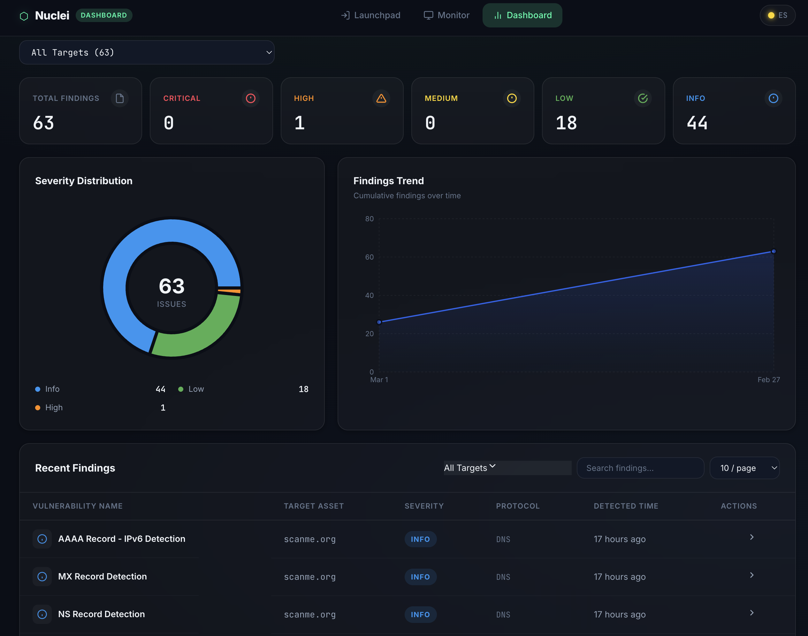

<div align="center">

# ⚛️ Nuclei Dashboard

**A containerized web GUI for the [Nuclei](https://github.com/projectdiscovery/nuclei) vulnerability scanner.**

Run scans, monitor progress in real time, and explore results — all from your browser. Zero CLI knowledge required.

[](https://www.docker.com/)
[](https://www.elastic.co/)
[](https://react.dev/)
[](https://nodejs.org/)
[](LICENSE)



</div>

---

## 📸 Features

| Feature                     | Description                                                                                       |
| --------------------------- | ------------------------------------------------------------------------------------------------- |
| **🚀 Launchpad**            | Enter targets, select Nuclei tags by category, and launch scans in one click.                     |
| **📡 Real-Time Monitor**    | Watch scan progress with a live console log stream via WebSocket.                                 |
| **📊 Analytics Dashboard**  | Severity breakdown charts (Recharts), searchable results table, and raw request/response details. |
| **🐳 All-in-One Container** | Nuclei + Elasticsearch + Backend + Frontend — packaged in a single Docker image.                  |
| **💾 Persistent Storage**   | Elasticsearch data and Nuclei templates survive container restarts via Docker volumes.            |

---

## 🏗️ Architecture

```
┌─────────────────────────────────────────────────┐
│                Docker Container                 │
│                                                 │
│  ┌───────────┐  ┌───────────┐  ┌─────────────┐ │
│  │  Nginx    │  │  Express  │  │Elasticsearch│ │
│  │  :8080    │──│  :3001    │──│   :9200     │ │
│  │ (Frontend)│  │ (Backend) │  │ (Database)  │ │
│  └───────────┘  └───────────┘  └─────────────┘ │
│                      │                          │
│                 ┌────┴────┐                     │
│                 │ Nuclei  │                     │
│                 │ Scanner │                     │
│                 └─────────┘                     │
│                                                 │
│          Managed by Supervisord                 │
└─────────────────────────────────────────────────┘
```

| Layer             | Technology                             |
| ----------------- | -------------------------------------- |
| **Frontend**      | React 19, Vite, Recharts, React Router |
| **Backend**       | Node.js 20, Express, WebSocket (`ws`)  |
| **Database**      | Elasticsearch 8.12 (single-node)       |
| **Scanner**       | Nuclei (latest stable)                 |
| **Orchestration** | Supervisord, Nginx reverse proxy       |

---

## 🚀 Quick Start

### Prerequisites

- [Docker](https://docs.docker.com/get-docker/) (v20.10+)
- [Docker Compose](https://docs.docker.com/compose/install/) (v2+)
- At least **2 GB of free RAM** (Elasticsearch requirement)

### Installation

**1. Clone the repository**

```bash
git clone https://github.com/ach-eddine/nuclei-web.git
cd nuclei-web
```

**2. Build and start the container**

```bash
docker compose up --build -d
```

**3. Open the dashboard**

Navigate to **[http://localhost:8080](http://localhost:8080)** in your browser.

> **Note:** Elasticsearch may take 15–30 seconds to become healthy on first boot. The UI will display a "Waiting for Elasticsearch…" state until it's ready.

### Stopping the application

```bash
docker compose down
```

To also remove persisted data (scan results & templates):

```bash
docker compose down -v
```

---

## ⚙️ Configuration

### Ports

| Service           | Port   | Description                            |
| ----------------- | ------ | -------------------------------------- |
| **Dashboard UI**  | `8080` | Main web interface (Nginx)             |
| **Backend API**   | `3001` | REST API + WebSocket                   |
| **Elasticsearch** | `9200` | Internal only (not exposed by default) |

To change the exposed ports, edit `docker-compose.yml`:

```yaml
ports:
  - "9090:8080" # Access UI on port 9090 instead
  - "4001:3001" # Access API on port 4001 instead
```

### Volumes

| Volume             | Container Path                  | Purpose                              |
| ------------------ | ------------------------------- | ------------------------------------ |
| `es-data`          | `/usr/share/elasticsearch/data` | Elasticsearch indices (scan results) |
| `nuclei-templates` | `/root/.local/nuclei-templates` | Cached Nuclei templates              |

### Environment Variables

| Variable       | Default                 | Description                  |
| -------------- | ----------------------- | ---------------------------- |
| `ES_JAVA_OPTS` | `-Xms512m -Xmx512m`     | Elasticsearch JVM heap size  |
| `ES_NODE`      | `http://localhost:9200` | Elasticsearch connection URL |

---

## 🖥️ Usage

### 1. Configure Your Scan

- Enter a target URL or IP address in the **Launchpad**.
- Select scan tags from organized categories (CVEs, exposures, misconfigurations, etc.).
- Choose scan mode: **Silent** or **Verbose**.

### 2. Monitor Scan Progress

- Switch to the **Monitor** tab to see real-time output.
- The live console streams Nuclei's `stdout` via WebSocket.
- Check the Elasticsearch health indicator for database connectivity.

### 3. Analyze Results

- The **Dashboard** displays a severity breakdown chart.
- Use the results table to search, filter, and sort findings.
- Click any row to view raw HTTP request/response proof-of-concept details.

---

## 🛠️ Development

If you want to run the services individually for development:

### Backend

```bash
cd backend
npm install
npm run dev     # Starts with --watch for auto-reload
```

### Frontend

```bash
cd frontend
npm install
npm run dev     # Vite dev server on http://localhost:5173
```

> **Requires** a running Elasticsearch instance at `http://localhost:9200`.

---

## 📁 Project Structure

```
nuclei-web/
├── backend/                  # Express.js API server
│   └── src/
│       ├── index.js          # Server entry point + WebSocket setup
│       └── routes/
│           ├── health.js     # Elasticsearch health check
│           ├── scan.js       # Nuclei scan trigger
│           └── results.js    # Query scan results from ES
├── frontend/                 # React + Vite SPA
│   └── src/
│       ├── App.jsx           # Router & layout
│       ├── pages/            # Launchpad, Monitor, Dashboard
│       ├── components/       # Shared UI components
│       └── services/         # API & WebSocket clients
├── docker/
│   ├── Dockerfile            # Multi-stage build
│   ├── entrypoint.sh         # Container bootstrap
│   ├── supervisord.conf      # Process management
│   └── nginx.conf            # Reverse proxy config
├── docker-compose.yml        # One-command deployment
└── PRD.md                    # Product Requirements Document
```

---

## 🤝 Contributing

Contributions are welcome! Please follow these steps:

1. **Fork** the repository.
2. **Create** a feature branch: `git checkout -b feature/my-feature`
3. **Commit** your changes: `git commit -m 'Add my feature'`
4. **Push** to your branch: `git push origin feature/my-feature`
5. **Open** a Pull Request.

---

## 📄 License

This project is licensed under the [MIT License](LICENSE).

---

<div align="center">
  <sub>Built with ❤️ using Nuclei, Elasticsearch, React, and Docker.</sub>
</div>
